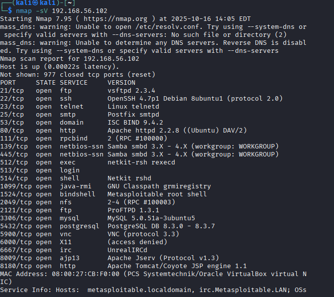
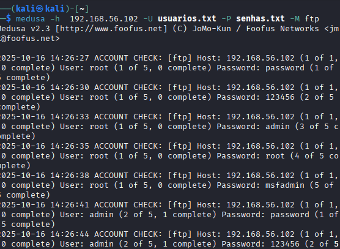
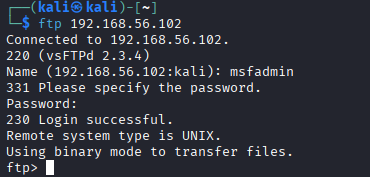

### Sobre o projeto
> Projeto prático desenvolvido para o bootcamp de Cibersegurança da DIO. O objetivo é documentar a simulação de ataques de força bruta em um ambiente de laboratório controlado, utilizando Kali Linux, Medusa e Metasploitable 2 para identificar vulnerabilidades e propor medidas de segurança eficazes.

---

### 📖 Sumário
* [Tecnologias Utilizadas](#-tecnologias-utilizadas)
* [Ajustes e Melhorias](#-ajustes-e-melhorias)
* [Pré-requisitos](#-pré-requisitos)
* [Configurando o Ambiente e Reconhecimento](#-configurando-o-ambiente-e-reconhecimento)
* [Executando os Cenários de Ataque](#-executando-os-cenários-de-ataque)
  * [Cenário 1: FTP Brute Force](#cenário-1-ftp-brute-force)
  * [Cenário 2: Web Form Brute Force (DVWA)](#cenário-2-web-form-brute-force-dvwa)
  * [Cenário 3: SMB Password Spraying](#cenário-3-smb-password-spraying)
* [Análise de Riscos e Mitigações](#-análise-de-riscos-e-mitigações)
* [Licença](#-licença)
* [Autor](#-autor)

---

### 🛠️ Tecnologias Utilizadas
- **Virtualização:** VirtualBox
- **Sistemas Operacionais:** Kali Linux (Atacante) e Metasploitable 2 (Vítima)
- **Ferramentas de Pentest:**
  - `Nmap` (Mapeamento de Rede)
  - `Medusa` (Ataque de Força Bruta)
  - `Enum4linux` (Enumeração de SMB)
- **Ambientes Vulneráveis:**
  - `vsftpd 2.3.4`
  - `Damn Vulnerable Web Application (DVWA)`
  - `Samba 3.0.20`

---

### 📊 Ajustes e Melhorias
O projeto foi concluído conforme o escopo do desafio.

- [x] Configuração do ambiente de laboratório virtual
- [x] Execução de ataque de força bruta em FTP
- [x] Execução de ataque de força bruta em formulário Web (DVWA)
- [x] Execução de password spraying em SMB
- [x] Documentação completa do processo e recomendações de segurança

---

### 💻 Pré-requisitos

Antes de começar, verifique se você atendeu aos seguintes requisitos para replicar o ambiente:

- Você instalou a versão mais recente do **VirtualBox**.
- Você tem uma máquina **Linux / Windows / Mac** capaz de executar VMs.
- Você realizou o download das imagens do **Kali Linux** e **Metasploitable 2**.
- Você leu a documentação oficial do **[Medusa](http://foofus.net/goons/jmk/medusa/medusa.html)** para entender seus parâmetros.

---

### 🚀 Configurando o Ambiente e Reconhecimento
Para configurar o laboratório de pentest, as VMs foram configuradas em uma rede Host-Only. A conectividade foi validada com um teste de `ping` e, em seguida, um scan de reconhecimento com `Nmap` foi executado para identificar os serviços expostos na máquina alvo.

**Validação de Conectividade:**


**Scan de Reconhecimento:**



---

### ⚔️ Executando os Cenários de Ataque

### Cenário 1: FTP Brute Force
O serviço `vsftpd 2.3.4` na porta 21 foi o alvo. Um ataque de dicionário com Medusa foi realizado para encontrar credenciais válidas.

**Comando Utilizado:**



**Resultado e Validação:**
A credencial `msfadmin:msfadmin` foi descoberta. Para validar, foi realizado um login manual no serviço FTP, que confirmou o acesso bem-sucedido.

**Evidência de Sucesso:**



### Cenário 2: Web Form Brute Force (DVWA)
O alvo foi o formulário de Brute Force do DVWA (Damn Vulnerable Web Application), com nível de segurança baixo. O objetivo era descobrir a senha do usuário `admin`.

**Comando Utilizado:**

```bash
medusa -h 192.168.56.101 -u admin -P senhas.txt -M http -m GET -m FORM:"/dvwa/vulnerabilities/brute/?username=^USER^&password=^PASS^&Login=Login" -m DENY-SIGNAL:"incorrect
```

### 🛡️ Análise de Riscos e Mitigações

**Com base nas vulnerabilidades exploradas, as seguintes contramedidas são recomendadas para fortalecer a segurança do ambiente:**

- Política de Senhas Fortes: Implementar uma política rigorosa que exija senhas com no mínimo 12 caracteres, combinando letras maiúsculas, minúsculas, números e símbolos. Proibir o uso de nomes de usuário, sequências ou palavras comuns como senha.
- Bloqueio de Contas (Account Lockout): Configurar todos os serviços para bloquear temporariamente uma conta (ex: por 15 minutos) após 3 a 5 tentativas de login sem sucesso. Isso neutraliza a eficácia de ataques de força bruta automatizados.
- Uso de Protocolos Seguros: Substituir o FTP, que transmite credenciais em texto claro, por alternativas seguras como SFTP (SSH File Transfer Protocol) ou FTPS (FTP over SSL/TLS) para garantir a criptografia.
- Segurança em Aplicações Web: Implementar CAPTCHA após algumas tentativas de login e, como camada principal de defesa, habilitar a Autenticação de Múltiplos Fatores (MFA) em todos os formulários de autenticação.
- Monitoramento e Alertas: Configurar logs de segurança para registrar todas as tentativas de login (sucesso e falha) e criar alertas para um número anômalo de falhas vindas de um mesmo endereço IP, podendo ser integrado a ferramentas como o Fail2Ban para bloqueio automático.

### 📜 Licença
Este projeto está sob a licença MIT. Veja o arquivo para mais detalhes.


### Autor
Feito por **José "([Zev](https://github.com/Zev07))" Silva**
